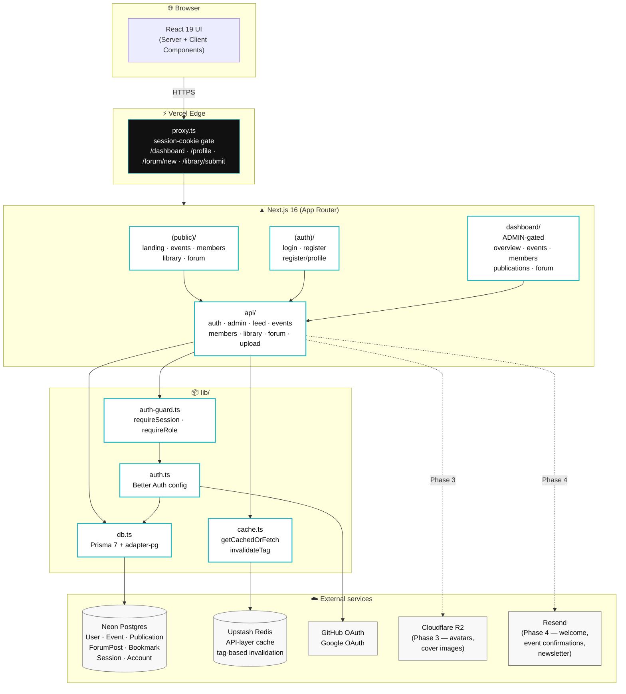

# React JS Rwanda — Community Platform

The official open-source platform for Rwanda's React developer community. Events, publications, a member directory, a public forum, and an admin dashboard — built by the community, for the community.

> **Status:** Foundation (v0.1) — scaffold is up, contributors are picking up GitHub Issues for features. See `project-phases.md` for the roadmap.

---

## Architecture



**How a request flows:**

1. Browser hits any URL → **Vercel Edge** runs `proxy.ts`, which checks for a valid Better Auth session cookie on gated routes.
2. Request reaches the **Next.js App Router**: public pages render with React Server Components fetching directly from Prisma; client pages use React Query against `/api/*` routes.
3. **API routes** call `requireSession()` / `requireRole()` for defense-in-depth (the edge proxy is fast but the role check needs a DB lookup).
4. Hot reads (lists, stats, feeds) go through `getCachedOrFetch()` → **Upstash Redis** (60s–5min TTL). Mutations call `invalidateTag()` to bust the relevant cache.
5. Auth flows use **Better Auth** with the Prisma adapter — sessions, accounts, and verification tokens live in Neon alongside the domain data.

## Stack

- **Next.js 16** (App Router, no `src/`)
- **TypeScript 5** strict
- **Tailwind CSS v4** (CSS-only config via `@theme` in `app/globals.css`)
- **shadcn/ui** primitives
- **Prisma 7** + **Neon PostgreSQL**
- **Upstash Redis** for API-layer caching
- **Better Auth** + GitHub OAuth
- **React Query** (client data), **React Hook Form + Zod** (forms)
- **Framer Motion** (motion), **Sonner** (toasts), **Lucide** (icons)
- **Resend** (email), **Cloudflare R2** (file uploads)

The full approved stack — and the libraries we don't allow — live in [`TECHSTACK.md`](./TECHSTACK.md).

## Design

Editorial-tech style: sharp rectangles (0px radius), heavy display typography, one cyan accent (`#1DB8C3`), no dark mode. Full spec in [`design-style-guide.md`](./design-style-guide.md).

## Getting started

```bash
# 1. Install pnpm if you don't have it
npm install -g pnpm

# 2. Install dependencies
pnpm install

# 3. Copy env file and fill in values (see .env.example)
cp .env.example .env.local

# 4. Push schema and seed the database
pnpm db:push
pnpm db:generate
pnpm db:seed

# 5. Run the dev server
pnpm dev
```

The app runs at <http://localhost:3000>.

You will need accounts on:
- **Neon** for PostgreSQL — <https://neon.tech>
- **Upstash** for Redis — <https://upstash.com>
- **GitHub** for OAuth — <https://github.com/settings/developers>
- **Resend** for email (Phase 4) — <https://resend.com>
- **Cloudflare R2** for file storage (Phase 3) — <https://dash.cloudflare.com>

## Project structure

The full canonical layout lives in [`CONTRIBUTING.md`](./CONTRIBUTING.md) §3. Every PR must follow it.

```
app/                  → Next.js App Router (public routes, auth, dashboard, api)
components/           → React components (layout, home, events, members, library, forum, ui)
lib/                  → db, cache, auth, utils
prisma/               → schema + seed
emails/               → React Email templates
hooks/, types/        → shared hooks and TS types
```

## Contributing

This is an open-source project — pick an issue from the backlog and ship a PR.

1. Read [`CONTRIBUTING.md`](./CONTRIBUTING.md) in full before opening your first PR.
2. Read [`design-style-guide.md`](./design-style-guide.md) — the rules are strict (0px radius, no shadows on cards, `#1DB8C3` only, no dark mode).
3. Read [`TECHSTACK.md`](./TECHSTACK.md) — never introduce a library without an approved Discussion.

## Scripts

| Script | What it does |
| --- | --- |
| `pnpm dev` | Start the dev server |
| `pnpm build` | Production build |
| `pnpm start` | Run the production build |
| `pnpm lint` | Run ESLint |
| `pnpm db:push` | Push schema to the database |
| `pnpm db:generate` | Regenerate the Prisma client |
| `pnpm db:seed` | Seed the database with sample data |
| `pnpm db:studio` | Open Prisma Studio |
| `pnpm db:reset` | Drop everything and reseed |

## Community

- **Discord** — `#rjsrw-platform-dev` (link in CONTRIBUTING)
- **GitHub Discussions** — for design/architecture proposals
- **Weekly dev call** — Saturdays, 10am EAT

## License

[MIT](./LICENSE) — built by the React JS Rwanda community.
